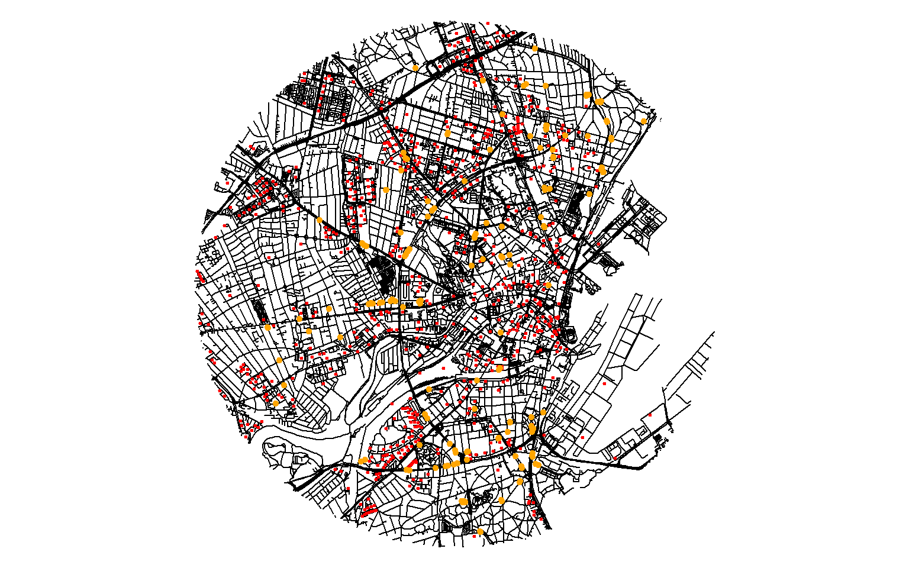

# Shelter Accessibility
*ANALYSIS*

MELICA investigates the empirical basis of Cold-War preparedness in Aarhus by (1) reconstructing the everyday experience of individuals living in Cold-War Aarhus through spatial analysis of shelter locations and text analysis of written sources. This repository analyzes the overall accessibility of shelters on foot or by bike, utilizing sfnetworks to build a network of roads from OSM data within the radius of 3 and 5 km of Den Gamle By in order to test and illustrate how and within what timeframes the residents of Aarhus can reach shelter. This repository is the basis for shelter-equity analysis based on the accessibility indeces.

---

## Purpose
Calculate how accessible BDGs are along urban road network by walking or bike.

---
## Authors
* Adela Sobotkova ]), MELICA project, adela@cas.au.dk

## License
CC-BY-SA 4.0, see attached License.md

## DOI
[Here will be DOI or some other identifier once we have it]

### References
[Here will go related articles or other sources we will publish/create]

---
# How to use this repository

## Sources and prerequisites
Network data come from OpenStreetMap and shelter locations from shelter-data repository, where locations extracted from the CDC archive were digitized and vectorized.

### Data
OSM road data were extracted in 2024. Shelter-data were digitized and streamlined on the basis of archival documents, historical imagery and field visits in the course of 2023-2025.

### Software
1. R 4.3.3

### Hardware
1. Multiple-screens
2. Mouse
3. Coffee

## Shelters within the radius of 3km around Den Gamle By in the center of Aarhus

